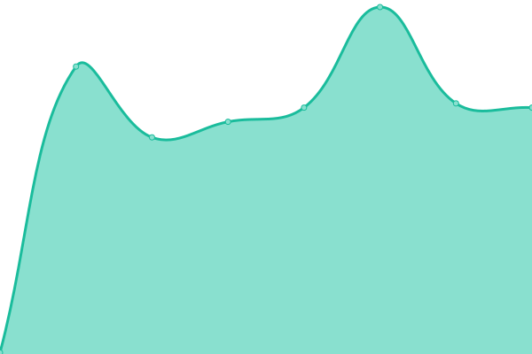
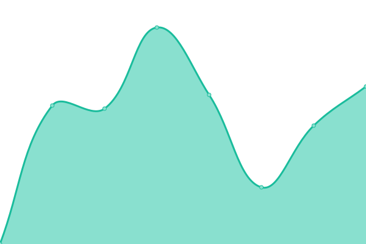
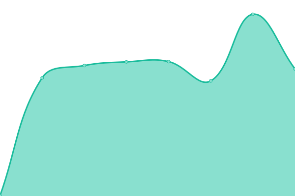

# [📈 Live Status](https://koll.serverkoll.se): <!--live status--> **🟧 Partial outage**

This repository contains the open-source uptime monitor and status page for [kennethdolk](https://koll.serverkoll.se), powered by [Upptime](https://github.com/upptime/upptime).

With [Upptime](https://upptime.js.org), you can get your own unlimited and free uptime monitor and status page, powered entirely by a GitHub repository. We use [Issues](https://github.com/kennethdolk/serverkoll/issues) as incident reports, [Actions](https://github.com/kennethdolk/serverkoll/actions) as uptime monitors, and [Pages](https://koll.serverkoll.se) for the status page.

<!--start: status pages-->
<!-- This summary is generated by Upptime (https://github.com/upptime/upptime) -->
<!-- Do not edit this manually, your changes will be overwritten -->
<!-- prettier-ignore -->
| URL | Status | History | Response Time | Uptime |
| --- | ------ | ------- | ------------- | ------ |
|  [Google](https://www.google.com) | 🟩 Up | [google.yml](https://github.com/kennethdolk/serverkoll/commits/HEAD/history/google.yml) | 

 194ms
     
 | 

<a href="https://koll.serverkoll.se/history/google">100.00%</a>
    

|  [Wikipedia](https://en.wikipedia.org) | 🟩 Up | [wikipedia.yml](https://github.com/kennethdolk/serverkoll/commits/HEAD/history/wikipedia.yml) | 

 188ms
     
 | 

<a href="https://koll.serverkoll.se/history/wikipedia">100.00%</a>
    

|  [Printe](https://printe.se) | 🟥 Down | [printe.yml](https://github.com/kennethdolk/serverkoll/commits/HEAD/history/printe.yml) | 

 0ms
     
 | 

<a href="https://koll.serverkoll.se/history/printe">0.00%</a>
    

|  [Nya Frillan](https://nyafrillan.se) | 🟩 Up | [nya-frillan.yml](https://github.com/kennethdolk/serverkoll/commits/HEAD/history/nya-frillan.yml) | 

 1661ms
     
 | 

<a href="https://koll.serverkoll.se/history/nya-frillan">100.00%</a>
    

|  [Svedja](https://svedja.se) | 🟩 Up | [svedja.yml](https://github.com/kennethdolk/serverkoll/commits/HEAD/history/svedja.yml) | 

 477ms
     
 | 

<a href="https://koll.serverkoll.se/history/svedja">99.82%</a>
    

|  [Doko](https://doko.se) | 🟩 Up | [doko.yml](https://github.com/kennethdolk/serverkoll/commits/HEAD/history/doko.yml) | 

 257ms
     
 | 

<a href="https://koll.serverkoll.se/history/doko">100.00%</a>
    

<!--end: status pages-->

[**Visit our status website →**](https://koll.serverkoll.se)

## 📄 License

- Powered by: [Upptime](https://github.com/upptime/upptime)
- Code: [MIT](./LICENSE) © [kennethdolk](https://koll.serverkoll.se)
- Data in the `./history` directory: [Open Database License](https://opendatacommons.org/licenses/odbl/1-0/)
